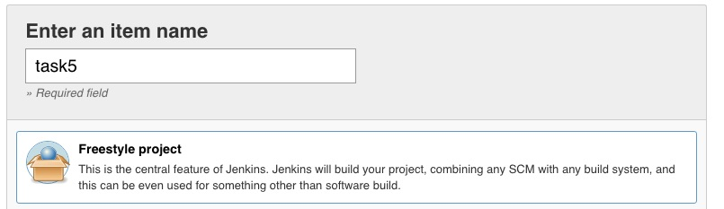
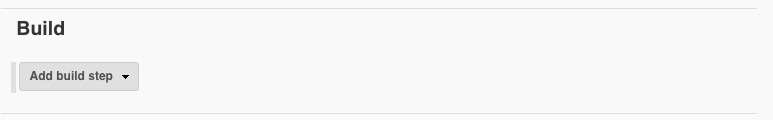
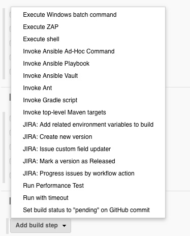

Task5: Create a Jenkins Freestyle Job
=============================

0. Clean your Load Balancing configuration
-------------------------------------------------
Please clean your Load Balancing configuration before you begin so you can see all the magic and claim nothing was hidden in your sleeves.
Do it through the WebUI and remove:
	* Virtual Server
	* Pool
	* Nodes

1. Create a new Job
---------------------------

On the jumphost, go to: http://127.0.0.1:8080

and log in with the jenkins administrator credentials:
	* User: **jenkins**
	* Password: **default**

On the left hand menu, click on ** New Item**

.. image:: ../images/image001.jpg
   :scale: 50 %
   :align: center 

Let’s call this job **task5**
Select **Freestyle Project**

click **Ok**

2. Configure the job
--------------------------
	**A/ Add the rundocker playbook invocation to the jenkins job**

(optional) add into the description field: *"This is simple freestyle job to run sequentially 2 ansible playbooks.”*

scroll down to the end of the job until you reach the **Build** category.

Then add a build step by clicking on **“Add a build step"**

It will open a drop down list with all the baked in plugins and the additional plugins you could have installed on your Jenkins server.

Click on **Invoke Ansible Playbook**

Firstly, let’s configure the invocation of the run docker playbook.

in the playbook path, add the following line:
**/tmp/task3.yml**

Do not specify Inventory, as we will use the main inventory (/etc/ansible/hosts).

	**B/ Add the lbsvc playbook invocation to the jenkins job**

Add a new **Invoke Ansible Playbook** as an additional build step of your job:

We will now run the task4.yml Ansible playbook, which is in charge of deploying the configuration on your bigip:

.. image:: ../images/image008.jpeg
   :scale: 50 %
   :align: center 

Again, we will use the main host file, so you don’t need to specify an extra inventory.

there are yet no vault credentials available in our configuration. Let’s create a new credential entry in Jenkins to store our ansible vault password.
Click on “Add” on the “Vault Credentials” line.

Select **Secret text** as a credential *kind*:

Then, fill the required fields with the following values:
	* secret: **Your Vault Password**
	* ID: vaultTask4
	* Description: Ansible vault password for the lbsvc role execution

Note:
	You have seen Jenkins can store different kind of confidential data in its credential store.
	
You can reorder the two playbooks invocations easily by clicking and dragging the 2 **Invoke Ansible Playbook** on their top left corner as the two playbooks are independent of each other.

Click ** Save **

3. Run the freestyle job
-------------------------
On the left hand menu, you can run the playbook by clicking on the *Build now** button

On the Build History window on the bottom left corner, you can have details on the execution of your job:

click on the #number of your execution.
it will open a new page for this job execution (called build).

the **Console Output** button will give you insights on the build steps:

.. parsed-literal::

    Started by user Jenkins admin
    Building in workspace /var/lib/jenkins/workspace/task5
    [task5] $ ansible-playbook /tmp/task3.yml -f 5
    [DEPRECATION WARNING]: DEFAULT_SUDO_USER option, In favor of Ansible Become, 
    which is a generic framework. See become_user. , use become instead. This 
    feature will be removed in version 2.8. Deprecation warnings can be disabled by
    setting deprecation_warnings=False in ansible.cfg.
    [WARNING]: Found variable using reserved name: remote_user

    PLAY [me] **********************************************************************

    TASK [Gathering Facts] *********************************************************
    ok: [127.0.0.1]

    TASK [fch.rundocker : create and run a docker container] ***********************
    changed: [127.0.0.1 -> localhost] => (item=9081)
    changed: [127.0.0.1 -> localhost] => (item=9082)
    changed: [127.0.0.1 -> localhost] => (item=9083)

    PLAY RECAP *********************************************************************
    127.0.0.1                  : ok=2    changed=1    unreachable=0    failed=0   

    [task5] $ ansible-playbook /tmp/task4.yml -f 5 --vault-password-file /var/lib/jenkins/workspace/task5/vault8754706889869935773.password
    [DEPRECATION WARNING]: DEFAULT_SUDO_USER option, In favor of Ansible Become, 
    which is a generic framework. See become_user. , use become instead. This 
    feature will be removed in version 2.8. Deprecation warnings can be disabled by
    setting deprecation_warnings=False in ansible.cfg.

    PLAY [Configure http service] **************************************************

    TASK [fch.lbsvc : Create nodes] ************************************************
    changed: [192.168.1.143 -> localhost] => (item={u'host': u'10.100.26.144', u'port': u'80'})
    changed: [192.168.1.143 -> localhost] => (item={u'host': u'10.100.26.145', u'port': u'80'})
    [DEPRECATION WARNING]: Param 'user' is deprecated. See the module docs for more
    information. This feature will be removed in version 2.9. Deprecation warnings
    can be disabled by setting deprecation_warnings=False in ansible.cfg.
    [DEPRECATION WARNING]: Param 'password' is deprecated. See the module docs for 
    more information. This feature will be removed in version 2.9. Deprecation 
    warnings can be disabled by setting deprecation_warnings=False in ansible.cfg.
    [DEPRECATION WARNING]: Param 'server' is deprecated. See the module docs for 
    more information. This feature will be removed in version 2.9. Deprecation 
    warnings can be disabled by setting deprecation_warnings=False in ansible.cfg.
    [DEPRECATION WARNING]: Param 'validate_certs' is deprecated. See the module 
    docs for more information. This feature will be removed in version 2.9. 
    Deprecation warnings can be disabled by setting deprecation_warnings=False in 
    ansible.cfg.

    TASK [fch.lbsvc : Create pool] *************************************************
    changed: [192.168.1.143 -> localhost]

    TASK [fch.lbsvc : Add Pool members] ********************************************
    changed: [192.168.1.143 -> localhost] => (item={u'host': u'10.100.26.144', u'port': u'80'})
    changed: [192.168.1.143 -> localhost] => (item={u'host': u'10.100.26.145', u'port': u'80'})

    TASK [fch.lbsvc : Add Virtual Server] ******************************************
    changed: [192.168.1.143 -> localhost]

    TASK [fch.lbsvc : Add Redirect Virtual Server] *********************************
    changed: [192.168.1.143 -> localhost]

    PLAY RECAP *********************************************************************
    192.168.1.143              : ok=5    changed=5    unreachable=0    failed=0   

    Finished: SUCCESS
