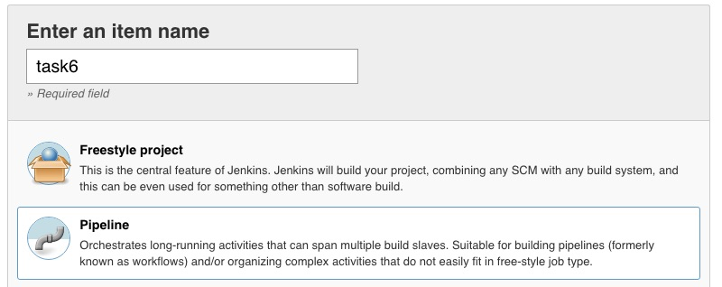

Task6: Create a pipeline as script
==================================

Freestyle jobs are quite easy, but it is not very flexible and could be very complex to understand and manage if you have too many build steps.

pipelines as code (do not panic! you won’t have to code here, we will provide you the scripts afterward) is more flexible and add the following benefits:
	* collect and manage parameters
	* manage build steps sequentially or in parallel
	* easy to manage high number of stages in your build.

1. Introduction
---------------
Let’s begin by creating a new job:

Let's call this pipeline **task6** and choose the **pipeline** mode

click **Ok**

2. Configure Pipeline
-----------------------

We will add parameters in this pipeline so users can add different values to override the default parameters defined in the ansible roles.

click on the **This project is parameterised** checkbox, then add a string parameter:

We will call this parameter **vsIP** which corresponds to the IP Address of the F5 Virtual Server.

Do the same for:
	* appName (application name)
	* websrvPorts (list of the docker containers ports)
	* websrvIP (IP address of the docker host)

You can reorganize parameters as you wish, there is no impact on the pipeline. **BUT be careful of the syntax and the case sensitivity of parameter names**.

   .. image:: ../images/image021.jpeg
   :scale: 50 %
   :align: center 

At the bottom of the page, you will find the **Pipeline** definition.
Ensure the definition is ** Pipeline script** in the drop down list and paste the following content in the script text box:

.. parsed-literal::

	#!/usr/bin/env groovy

	import groovy.json.JsonOutput

	node {
	   stage('Preparation') { 
	       env.appName = params.appName
	       env.vsIP = params.vsIP
	       env.websrvPorts = params.websrvPorts
	       //env.poolMemberPorts = params.websrvPorts.split(',')
	       env.poolMemberIP = "10.100.26.192"

	   }
	   stage('the most useless step I have created') {
	       sh "echo --------------------------------"
	       sh "echo $appName"
	       sh "echo $vsIP"
	       sh "echo $websrvPorts"
	       sh "echo --------------------------------"
	   }

	    parallel(
		"Creating docker containers": {
		    stage('yet an other useless step')
			{
			    sh "echo I am starting my containers"
			}
		    stage('Creating dockers')
			{
			    ansiblePlaybook(
			    colorized: true, 
			    playbook: '/tmp/task3.yml', 
			    extras: '',
			    sudoUser: null,
			    extraVars: [
				container_ports : [websrvPorts]
			])
			}
		    stage('no comment...')
		    {
			sh "echo containers are ready"
		    }
		}, 
		"Configuring BigIP": {
		    stage('preparing pool member list'){
			def poolMemberPorts = websrvPorts.split(",")
			println "my ports: $poolMemberPorts"

			def numPorts = poolMemberPorts.size()
			echo "$numPorts"

			def listPool = []

			for(port in poolMemberPorts){
			    echo "working on this pool port: $port"
			    echo "{\"port\":\"" + port +"\", \"host\": \"" + poolMemberIP + "\"}"
			    listPool.add("{\"port\":\"" + port +"\", \"host\": \"" + poolMemberIP + "\"}")
			    println "my list: $listPool"

			    // [{"port":"80","host:"10.100.26.146"},{"port":"80","host:"10.100.26.146"}] 
			}
			env.pools = listPool.join(",")
			echo "Pool list: $pools"
		    }
		    stage('lbsvc')
			{

		    withCredentials([[$class: 'UsernamePasswordMultiBinding', credentialsId: 'bigips', usernameVariable: 'USERNAME', passwordVariable: 'PASSWORD']]) {
			    ansiblePlaybook(
			    colorized: true, 
			    playbook: '/tmp/task4.yml', 
			    extras: "-vvv",
			    sudoUser: null,
			    extraVars: [
				username: USERNAME,
				password: PASSWORD,
				app_name: appName,
				pool_members : [pools],
				vip_ip : vsIP
				]
			    )
			}
		    }
		})
	    stage('finishing...')
	    {
		sh "echo I have finished my pipeline."

	    }

	}

To run your pipeline, click on **Build with parameters**

It will open the following page:

Enter the following values:
	* appName: 	<anything you want>
	* vsIP: 	10.1.10.20
	* websrvPorts:	9034,9035,9036,9037
	* websrvIP: 	10.1.20.111

then click *Build*

You can visualize the execution of the pipeline in the **Console Output** of your build.
On the **Blue Ocean** interface the build is shown as follow:

