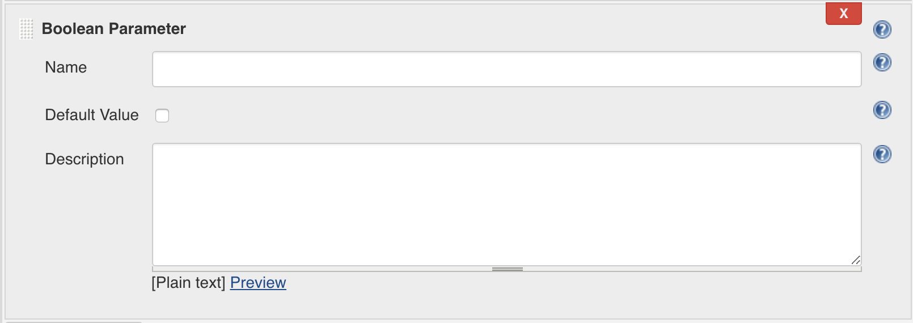

Task7: Attach an ASM Policy dynamically using a Jenkins pipeline
================================================================

1. Create a new Task
----------------------------

Create a new task : **task7** as a pipeline.

 

Click **OK**.

Check the box **This project is parameterized** and add a **String Parameter** called : **appName**.

We can also put a default value: *myApplication*
And a shot description for this field: * Please enter your application name*

 

At the bottom of the page we will configure the pipeline with the following definition:
  *	Definition: **Pipeline script from SCM**
  *	SCM: Git
  *	Repository URL: https://github.com/fchmainy/fch.attachWAF.git
  *	Credentials: none (default)
  *	Branch Specific: */master (default)
  *	Script Path: **Jenkinsfile**

Then save.

2. Run your task
---------------------

You can now run the Jenkins build by clicking on the *Build with Parameters* button

You can use the **MyAppTask4** application name as a variable so you will attach the Web Application Firewall policy to this related existing Virtual Server. 

What this pipeline does is to:
  1. clone a Git Repo where is defined a new Ansible role called fch.attachWAF
  2. copy this role in your Ansible roles directory
  3. Run the fch.attachWAF role so it can grab an F5 WAF Policy from a URL, send it to your bigIP and attach it to a Virtual Server.

You can have a look at the code and the YAML files of the role at : https://github.com/fchmainy/fch.attachWAF

3. (optional) Link this pipeline as Downstream job on the previous pipeline
--------------------------------------------------------------------------------------------------

If you have time, you can link this pipeline as a **Jenkins Downstream Job** on your task6 pipeline. 

Go back to your **task6** pipeline.
Then click on the **Configure** button.

At the end of the String Parameters you have previously configured, click on **Add Parameter**

Then choose **Boolean Parameter**
It will add a new parameter box you’re your parameters entries:

Let’s call this new Boolean parameter **secured** (Caution: parameters names are case sensitive).

We can also check **Default Value** so every app deployed will be secured by default and you will have to intentionally uncheck this box and leave your apps and data at the mercy of the bad guys

Insert the line in bold in the Preparation stage so you can get the **secured** boolean value from the input form:

.. parsed-literal::

   stage('Preparation') {
          env.appName = params.appName
          env.vsIP = params.vsIP
          env.websrvPorts = params.websrvPorts
          //env.poolMemberPorts = params.websrvPorts.split(',')
          env.poolMemberIP = params.websrvIP
          **env.secured = params.secured**
      }

Then insert the following groovy fancy code to your pipeline script after the **line 85**:

.. parsed-literal::

   stage('run downstream pipeline') {
           if ( secured )
               {
               echo "This is safer!"
               def job = build job: 'task7', parameters: [[$class:    'StringParameterValue', name: 'appName', value: appName]]           
               }
               else {
                   echo "I will tell it to your CSO!"

               }
      }

Click on  **save**

Then, run your build:

   
Enter the following values:
   * appName: myApplication
   * vsIP: 10.1.20.121
   * websrvPorts: 9061,9062,9063,9064
   * websrvIP: 10.1.10.20

then click Build   

When the pipeline will reach the **run downstream pipeline** stage, go to **Back to Dashboard > task7** and approve the end of the build.

You can then check on your bigIP that the VS **myAppTask7_vs_https** has been successfully created and has been associated with a WAF policy called **MyAppTask7_waf**.

**__That's all Folks!!!__**

   
 
